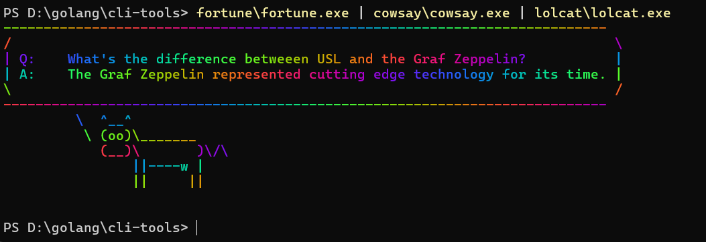

# Go CLI Tools 🐹🌈

Last summer (2024–2025), I interned at Canva as an Infrastructure Software Engineer Intern. During that time, I got to dive deep into Go, especially how it's used with the Terraform plugin framework to build custom Terraform providers. Since then, Go has become my favorite language!

Go is widely adopted for building cloud-native applications thanks to its lightweight concurrency model (shoutout to Goroutines!), strong typing, and seamless compatibility with tools like Terraform and Kubernetes. It's also a great choice for building CLI tools - being a compiled language with a strong standard library. While Python is awesome for scripting, Go offers similar flexibility with performance that’s closer to C++ or Rust.

This repo contains one of my first CLI projects in Go. It includes fun commands like `fortune`, `cowsay`, and `lolcat`, all re-implemented in Go. You can see an example output in the screenshot below 🌈🐄.

> Note: I built and tested this on Windows, but it should work on other OS too - just clone the repo and build it with Go. Results might vary slightly depending on your environment.

Enjoy playing around with it!
